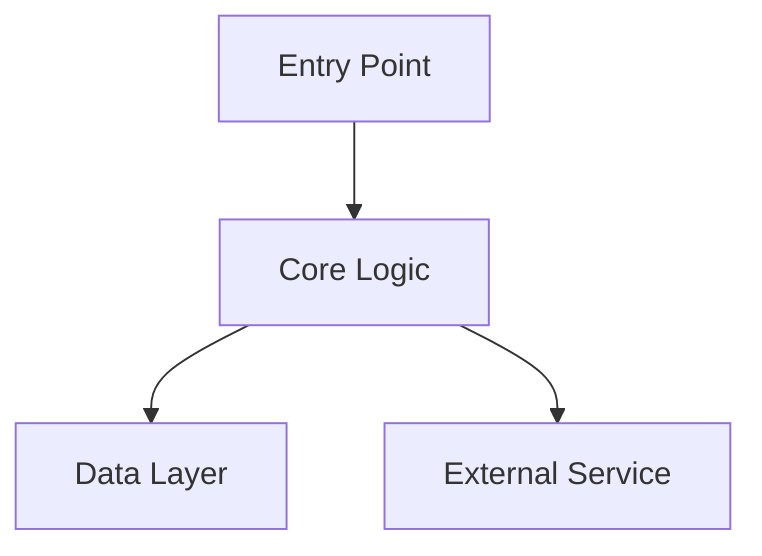

# SpecForge Output Format

Standard templates for all SpecForge domain artifact documents.

## SKILL.md Template (Skills 2.0 trigger file)

```yaml
---
name: [codebase-name]-[domain]
description: Use this skill when working on the [domain] domain of [codebase-name]. Provides architecture, conventions, and patterns for [what the domain does].
version: 0.1.0
---
```

# [Domain] Domain

**Analysis Date:** [YYYY-MM-DD]

## Overview
[2-3 sentence description of what this domain does and its role in the system]

## Key Concepts
- [Concept 1]: [Brief explanation]
- [Concept 2]: [Brief explanation]

## Quick Reference
| Document | Purpose |
|----------|---------|
| STACK.md | Technology choices for this domain |
| ARCHITECTURE.md | Bounded context + Mermaid diagram |
| STRUCTURE.md | Where code lives, where to add features |
| CONVENTIONS.md | Domain-specific coding patterns |
| TESTING.md | How to test this domain |
| CONCERNS.md | Tech debt with severity ratings |

## STACK.md Template

```markdown
# [Domain] — Technology Stack

**Analysis Date:** [YYYY-MM-DD]

## Primary Language & Runtime
- Language: [language] [version]
- Runtime: [runtime]

## Frameworks & Libraries
- [Framework] [version]: [Purpose] — `[import path]`

## Key Dependencies
- `[package]` [version]: [Why critical for this domain]

## Configuration
- [How domain is configured]
- [Key environment variables]

## Build
- [Build commands for this domain]
```

## ARCHITECTURE.md Template

```markdown
# [Domain] — Architecture

**Analysis Date:** [YYYY-MM-DD]

## Bounded Context
[What this domain owns and is responsible for]

## Mermaid Diagram



## Layers
- **[Layer]**: [Purpose] — `[path]`

## Data Flow
1. [Step 1]
2. [Step 2]

## Key Abstractions
- `[Type/Interface]` in `[file]`: [Purpose]
```

## STRUCTURE.md Template

```markdown
# [Domain] — Structure

**Analysis Date:** [YYYY-MM-DD]

## Directory Layout
```
[domain-root]/
├── [file/dir]    # [Purpose]
```

## Where to Add New Code
- New feature: `[path]`
- New test: `[path]`
- New type: `[path]`

## Key Files
- `[path]`: [Purpose]
```

## CONVENTIONS.md Template

```markdown
# [Domain] — Conventions

**Analysis Date:** [YYYY-MM-DD]

## Naming
- Functions: [pattern + example]
- Types: [pattern + example]
- Files: [pattern + example]

## Code Patterns
[Show actual patterns from the codebase with file paths]

## Error Handling
[Domain-specific error handling pattern]

## DO / DON'T
| Do | Don't |
|----|-------|
| [example] | [anti-pattern] |
```

## TESTING.md Template

```markdown
# [Domain] — Testing

**Analysis Date:** [YYYY-MM-DD]

## Run Tests
```bash
[test command for this domain]
```

## Test Organization
- Location: [co-located / separate]
- Naming: [pattern]

## Patterns
[Show actual test patterns from the codebase]

## What to Mock
- Mock: [what]
- Don't mock: [what]
```

## CONCERNS.md Template

```markdown
# [Domain] — Concerns

**Analysis Date:** [YYYY-MM-DD]

## [Concern Area]

**Severity: High / Medium / Low**

- Issue: [What's wrong]
- Files: `[file paths]`
- Impact: [What breaks or degrades]
- Fix: [How to address it]
```

## INTEGRATIONS.md Template

```markdown
# [Domain] — Integrations

**Analysis Date:** [YYYY-MM-DD]

## External APIs & Services
- [Service]: [Purpose]
  - Client: `[package]`
  - Auth: [env var or "N/A"]

## Environment Variables
- `[VAR_NAME]`: [Purpose]
```
